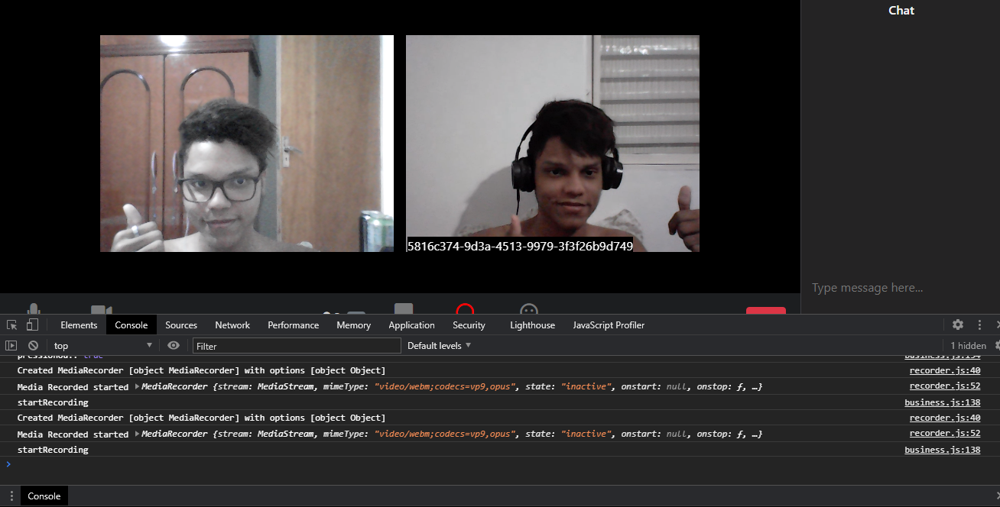

# Projeto JSExpert 2.0 - Zoom :yellow_heart:


- Acesse o [home](./aula04/public/pages/home/index.html) para acessar a home page
- Acesse o [room](./aula04/public/pages/room/index.html) uma room específica

## Techs
- [x] Javascript
- [x] Socket.io
- [x] PeerJS
- [x] Media Recorder API
- [x] Media Devices API

## Design Pattern
- [x] Builder

## Home Page


## Room


## Room in Call



## Sobre
Na semana javascript expert 2.0 construímos um projeto de streams de video conferência, similar ao que software _[Zoom](https://zoom.us)_ faz, utilizamos _Sockets_ para fazer a comunicação em tempo real e também fizemos o uso da tecnologia _WebRTC e Peer Server_ para identificar cada usuário conectado na chamada e torna-lo único, trabalhamos com o padrão Builder para manipulação de eventos e seguimos o principio da responsabilidade única, onde nosso arquivo _app.js_ é responsável pela execução de toda nossa aplicação, a classe de negócios (_Business_) é nossa controladora que também é conhecida como _(Controller)_ que é responsável pela manipulação de regras da nossa aplicação e da classe de visualização _(View)_, a pasta _util_ contém toda nossa implementação relacionada ao _Media Recorder API, Media Devices API, WebRTC,  PeerServer_ e _Sockets_.

## :video_game: Como executar a aplicação

```sh
# Criando pasta do projeto
$ mkdir zoom-clone && cd zoom-clone

# Iniciando o git
$ git init

# Adicione a origin do projeto do git utilizando SSH ou HTTPS Remote
(Add on SSH Remote)
$ git remote add origin git@github.com:HallexCosta/zoom.us.git
# Ou
(Add on HTTPS Remote)
$ git remote add origin https://github.com/HallexCosta/zoom.us.git

# Sincronizando o projeto remoto com o projeto local recém criado
$ git pull origin main

# Execute o arquivo script shell para restaurar os pacotes
$ ./build.sh

# PRONTO, Aparecera a seguinte mensagem de aviso.
Successfully generate project on folder 'build' with all dependencies

# Acesse o build do projeto
$ cd build

# Iniciando o projeto
$ cd public && yarn start
$ cd server && yarn start
$ cd peer-server && yarn dev

```  

## :memo: Licença

Esse projeto está sob a licença MIT. Veja o arquivo [LICENSE](https://github.com/HallexCosta/zoom.us/blob/master/LICENSE) para mais detalhes.  


## Créditos

- Layout da home foi baseada no codepen do [Nelson Adonis Hernandez
](https://codepen.io/nelsonher019/pen/eYZBqOm)
- Layout da room foi adaptado a partir do repo do canal [CleverProgrammers](https://github.com/CleverProgrammers/nodejs-zoom-clone/blob/master/views/room.ejs)

| Aluno | Professor |
|--|--|  
| [<br><sub>@HallexCosta</sub>](https://github.com/HallexCosta) | [<br><sub>@ErickWendel</sub>](https://github.com/ErickWendel) |
